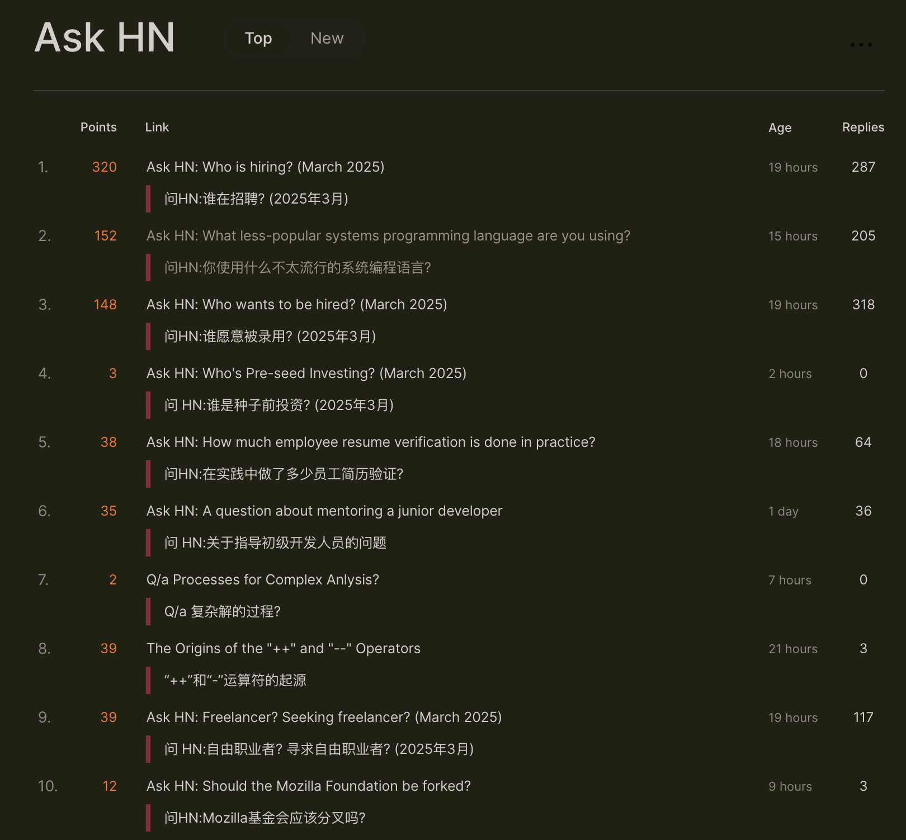

# MTranServer

> 迷你翻译服务器 测试版 ⭐️ 给我个 Star 吧

一个超低资源消耗超快的离线翻译服务器，英译中模型仅需 860MB 内存即可运行，无需显卡。单个请求平均响应时间 50ms。支持全世界主要语言的翻译。

翻译质量与 Google 翻译相当。

注意本模型专注于速度和多种设备私有部署，所以翻译质量肯定是不如大模型翻译的效果。

需要高质量的翻译建议使用在线大模型 API。

## Demo

> 暂无，看预览图



## 同类项目效果(CPU,英译中)

| 项目名称                                                               | 内存占用 | 并发性能 | 翻译效果 | 速度 | 其他信息                                                                                                                          |
| ---------------------------------------------------------------------- | -------- | -------- | -------- | ---- | --------------------------------------------------------------------------------------------------------------------------------- |
| [facebook/nllb](https://github.com/facebookresearch/fairseq/tree/nllb) | 很高     | 差       | 一般     | 慢   | Android 移植版的 [RTranslator](https://github.com/niedev/RTranslator) 有很多优化，但占用仍然高，速度也不快                        |
| [LibreTranslate](https://github.com/LibreTranslate/LibreTranslate)     | 很高     | 一般     | 一般     | 中等 | 中端 CPU 每秒处理 3 句，高端 CPU 每秒处理 15-20 句。[详情](https://community.libretranslate.com/t/performance-benchmark-data/486) |
| [OPUS-MT](https://github.com/OpenNMT/CTranslate2#benchmarks)           | 高       | 一般     | 略差     | 快   | [性能测试](https://github.com/OpenNMT/CTranslate2#benchmarks)                                                                     |
| 其他大模型                                                             | 超高     | 动态     | 好好     | 很慢 | 32B 及以上参数的模型效果不错，但是对硬件要求很高                                                                                  |
| MTranServer(本项目)                                                    | 低       | 高       | 一般     | 极快 | 单个请求平均响应时间 50ms                                                                                                         |

> 现有的 Transformer 架构的大模型的小参数量化版本不在考虑范围，因为实际调研使用发现翻译质量很不稳定且会乱翻，幻觉严重，速度也不快。
> 出了性能更优的 Diffusion 架构的语言模型，再测试。
>
> 表中数据仅供参考，非严格测试，非量化版本对比。

## 更新日志

2025.03.08 v1.0.4 -> v1.1.0

- 修复了内存溢出问题, 现在运行一个英译中模型仅需 800M+ 内存, 其他语言模型的内存占用也大幅降低
- 适配添加了多种插件的接口

  2025.03.07 v1.0.3 -> v1.0.4

- 添加波斯语、波兰语模型

## Compose 部署

目前仅支持 amd64 架构 CPU 的 Docker 部署。

需要 CPU 支持 AVX2 指令集, 其他 CPU 的兼容版本等我测试完成发布。

ARM、RISCV 架构在适配中 😳

### 桌面端 Docker 一键包

> 桌面端一键包部署需要安装 `Docker Desktop`，请自行安装。
>
> Windows、Mac 的 Docker Desktop 内存分配机制会给虚拟机分配比较多的内存，是正常的。Linux 服务器则是正常占用。

确保个人电脑上安装有 `Docker Desktop` 后，下载桌面端一键包

[中国大陆一键包下载地址](https://ocn4e4onws23.feishu.cn/drive/folder/QN1SfG7QeliVWGdDJ8Dce2sUnkf)

[国际一键包下载地址](https://github.com/xxnuo/MTranServer/releases/tag/onekey)

`解压`到任意英文目录，文件夹结构示意图如下：

```
mtranserver/
├── compose.yml
├── models/
│   ├── enzh
│   │   ├── lex.50.50.enzh.s2t.bin
│   │   ├── model.enzh.intgemm.alphas.bin
│   │   └── vocab.enzh.spm
```

> 若你位于中国大陆，网络无法访问 Docker 下载镜像，请跳转到下文的 `1.3 可选步骤`。
>
> 一键包仅包含英译中模型，如果需要下载其他语言的模型，请跳转到下文的 `2. 下载模型`。

在 `mtranserver` 目录内打开命令行，然后直接跳转到下文的 `3. 启动服务`。

### 服务器 Docker 手动部署

#### 1.1 准备

服务器准备一个存放配置的文件夹，打开终端执行以下命令

```bash
mkdir mtranserver
cd mtranserver
touch compose.yml
mkdir models
```

#### 1.2 用编辑器打开 `compose.yml` 文件，写入以下内容

> 1. 修改下面的 `your_token` 为你自己设置的一个密码，使用英文大小写和数字。自己内网可以不设置，如果是`云服务器`强烈建议设置一个密码，保护服务以免被`扫到、攻击、滥用`。
>
> 2. 如果需要更改端口，修改 `ports` 的值，比如修改为 `9999:8989` 表示将服务端口映射到本机 9999 端口。

```yaml
services:
  mtranserver:
    image: xxnuo/mtranserver:2.1.1
    container_name: mtranserver
    restart: unless-stopped
    ports:
      - "8989:8989"
    volumes:
      - ./models:/app/models
    environment:
      - CORE_API_TOKEN=your_token
```

#### 1.3 可选步骤

若你的机器在中国大陆无法正常联网下载镜像，可以按如下操作导入镜像

<a href="https://ocn4e4onws23.feishu.cn/drive/folder/PSUHfwmKPlu6PodAniVcNEPgnCb" target="_blank">中国大陆 Docker 镜像下载</a>

选择最新版的镜像 `mtranserver.image.tar` 下载保存到运行 Docker 的机器上。

进入下载到的目录打开终端，执行如下命令导入镜像

```bash
docker load -i mtranserver.image.tar
```

然后正常继续下一步下载模型

### 2. 下载模型

> 持续更新模型中，如果没有你需要的语言模型，可以联系我添加。

<a href="https://ocn4e4onws23.feishu.cn/drive/folder/C3kffkLr8lxdtid5GYicAcFAnTh" target="_blank">中国大陆模型镜像下载地址</a>

<a href="https://github.com/xxnuo/MTranServer/releases/tag/models" target="_blank">国际下载地址</a>

下载模型后，`解压`每个语言的压缩包到 `models` 文件夹内。

> 警告：如果使用多个模型，内存占用会成倍增加，请根据自己服务器配置选择合适的模型。

下载了英译中模型的当前文件夹结构示意图：

```
compose.yml
models/
├── enzh
│   ├── lex.50.50.enzh.s2t.bin
│   ├── model.enzh.intgemm.alphas.bin
│   └── vocab.enzh.spm
```

如果你下载添加多个模型，这是有中译英、英译中模型文件夹结构示意图：

```
compose.yml
models/
├── enzh
│   ├── lex.50.50.enzh.s2t.bin
│   ├── model.enzh.intgemm.alphas.bin
│   └── vocab.enzh.spm
├── zhen
│   ├── lex.50.50.zhen.t2s.bin
│   ├── model.zhen.intgemm.alphas.bin
│   └── vocab.zhen.spm
```

注意：例如中译日的过程是先中译英，再英译日，也就是需要两个模型 `zhen` 和 `enja`。其他语言翻译过程类似。

### 3. 启动服务

先启动测试，确保模型位置没放错、能正常启动加载模型、端口没被占用。

```bash
docker compose up
```

正常输出示例：

```
[+] Running 2/2
 ✔ Network sample_default  Created  0.1s
 ✔ Container mtranserver   Created  0.1s
Attaching to mtranserver
mtranserver  | (2025-03-03 12:49:24) [INFO    ] Using maximum available worker count: 16
mtranserver  | (2025-03-03 12:49:24) [INFO    ] Starting Translation Service
mtranserver  | (2025-03-03 12:49:24) [INFO    ] Service port: 8989
mtranserver  | (2025-03-03 12:49:24) [INFO    ] Worker threads: 16
mtranserver  | Successfully loaded model for language pair: enzh
mtranserver  | (2025-03-03 12:49:24) [INFO    ] Models loaded.
mtranserver  | (2025-03-03 12:49:24) [INFO    ] Using default max parallel translations: 32
mtranserver  | (2025-03-03 12:49:24) [INFO    ] Max parallel translations: 32
```

然后按 `Ctrl+C` 停止服务运行，然后正式启动服务器

```bash
docker compose up -d
```

这时候服务器就在后台运行了。

### 4. 使用

下面表格内的 `localhost` 可以替换为你的服务器地址或 Docker 容器名。

下面表格内的 `8989` 端口可以替换为你在 `compose.yml` 文件中设置的端口值。

如果未设置 `CORE_API_TOKEN` 或者设置为空，翻译插件使用`无密码`的 API。

如果设置了 `CORE_API_TOKEN`，翻译插件使用`有密码`的 API。

下面表格中的 `your_token` 替换为你在 `config.ini` 文件中设置的 `CORE_API_TOKEN` 值。

#### 翻译插件接口：

> 注：
>
> - [沉浸式翻译](https://immersivetranslate.com/zh-Hans/docs/services/custom/) 在`设置`页面，开发者模式中启用`Beta`特性，即可在`翻译服务`中看到`自定义 API 设置`([官方图文教程](https://immersivetranslate.com/zh-Hans/docs/services/custom/))。然后将`自定义 API 设置`的`每秒最大请求数`拉高以充分发挥服务器性能准备体验飞一般的感觉。我设置的是`每秒最大请求数`为`5000`，`每次请求最大段落数`为`10`。你可以根据自己服务器配置设置。
>
> - [简约翻译](https://github.com/fishjar/kiss-translator) 在`设置`页面，接口设置中滚动到下面，即可看到自定义接口 `Custom`。同理，设置`最大请求并发数量`、`每次请求间隔时间`以充分发挥服务器性能。我设置的是`最大请求并发数量`为`100`，`每次请求间隔时间`为`1`。你可以根据自己服务器配置设置。
>
> 接下来按下表的设置方法设置插件的自定义接口地址。注意第一次请求会慢一些，因为需要加载模型。以后的请求会很快。

| 名称                       | URL                                           | 插件设置                                                          |
| -------------------------- | --------------------------------------------- | ----------------------------------------------------------------- |
| 沉浸式翻译无密码           | `http://localhost:8989/imme`                  | `自定义API 设置` - `API URL`                                      |
| 沉浸式翻译有密码           | `http://localhost:8989/imme?token=your_token` | 同上，需要更改 URL 尾部的 `your_token` 为你的 `CORE_API_TOKEN` 值 |
| 简约翻译无密码             | `http://localhost:8989/kiss`                  | `接口设置` - `Custom` - `URL`                                     |
| 简约翻译有密码             | `http://localhost:8989/kiss`                  | 同上，需要 `KEY` 填 `your_token`                                  |
| 划词翻译自定义翻译源无密码 | `http://localhost:8989/hcfy`                  | `设置`-`其他`-`自定义翻译源`-`接口地址`                           |
| 划词翻译自定义翻译源有密码 | `http://localhost:8989/hcfy?token=your_token` | `设置`-`其他`-`自定义翻译源`-`接口地址`                           |

**普通用户参照表格内容设置好插件使用的接口地址就可以使用了。**

### 5. 保持更新

目前是测试版服务器和模型，可能会遇到问题，建议经常保持更新

从上文地址下载新模型，解压覆盖到原 `models` 模型文件夹

然后更新重启服务器：

```bash
docker compose down
docker pull xxnuo/mtranserver:2.1.1
docker compose up -d
```

> 国内用户若无法正常 `pull` 镜像，按照 `1.3 可选步骤` 手动下载新镜像导入即可。

### 开发者接口：

> Base URL: `http://localhost:8989`

| 名称               | URL                      | 请求格式                                                                               | 返回格式                                                           | 认证头                    |
| ------------------ | ------------------------ | -------------------------------------------------------------------------------------- | ------------------------------------------------------------------ | ------------------------- |
| 服务版本           | `/version`               | 无                                                                                     | `{"version": "v1.1.0"}`                                            | 无                        |
| 语言对列表         | `/models`                | 无                                                                                     | `{"models":["zhen","enzh"]}`                                       | Authorization: your_token |
| 普通翻译接口       | `/translate`             | `{"from": "en", "to": "zh", "text": "Hello, world!"}`                                  | `{"result": "你好，世界！"}`                                       | Authorization: your_token |
| 批量翻译接口       | `/translate/batch`       | `{"from": "en", "to": "zh", "texts": ["Hello, world!", "Hello, world!"]}`              | `{"results": ["你好，世界！", "你好，世界！"]}`                    | Authorization: your_token |
| 健康检查           | `/health`                | 无                                                                                     | `{"status": "ok"}`                                                 | 无                        |
| 心跳检查           | `/__heartbeat__`         | 无                                                                                     | `Ready`                                                            | 无                        |
| 负载均衡心跳检查   | `/__lbheartbeat__`       | 无                                                                                     | `Ready`                                                            | 无                        |
| 谷歌翻译兼容接口 1 | `/language/translate/v2` | `{"q": "The Great Pyramid of Giza", "source": "en", "target": "zh", "format": "text"}` | `{"data": {"translations": [{"translatedText": "吉萨大金字塔"}]}}` | Authorization: your_token |

> 开发者高级设置请参考 [CONFIG.md](./CONFIG.md)

## 源码仓库

Windows、Mac 和 Linux 独立客户端软件: [MTranServerDesktop](https://github.com/xxnuo/MTranServerDesktop) (未公开，请耐心等待正式版公开)

服务端 API 服务源码仓库: [MTranServerCore](https://github.com/xxnuo/MTranServerCore) (未公开，请耐心等待正式版公开)

## 感谢

推理框架: C++ [Marian-NMT](https://marian-nmt.github.io) 框架

翻译模型: [firefox-translations-models](https://github.com/mozilla/firefox-translations-models)

> Join us: [https://www.mozilla.org/zh-CN/contribute/](https://www.mozilla.org/zh-CN/contribute/)

## 赞助我

[Buy me a coffee ☕️](https://www.creem.io/payment/prod_3QOnrHlGyrtTaKHsOw9Vs1)

[中国大陆 💗 赞赏](./支持我)

## 联系我

微信: x-xnuo

X: [@realxxnuo](https://x.com/realxxnuo)

欢迎加我交流技术/开源相关项目/私有化部署～

找工作中：[关于我](/about)

## Star History

[](https://star-history.com/#xxnuo/MTranServer&Timeline)
